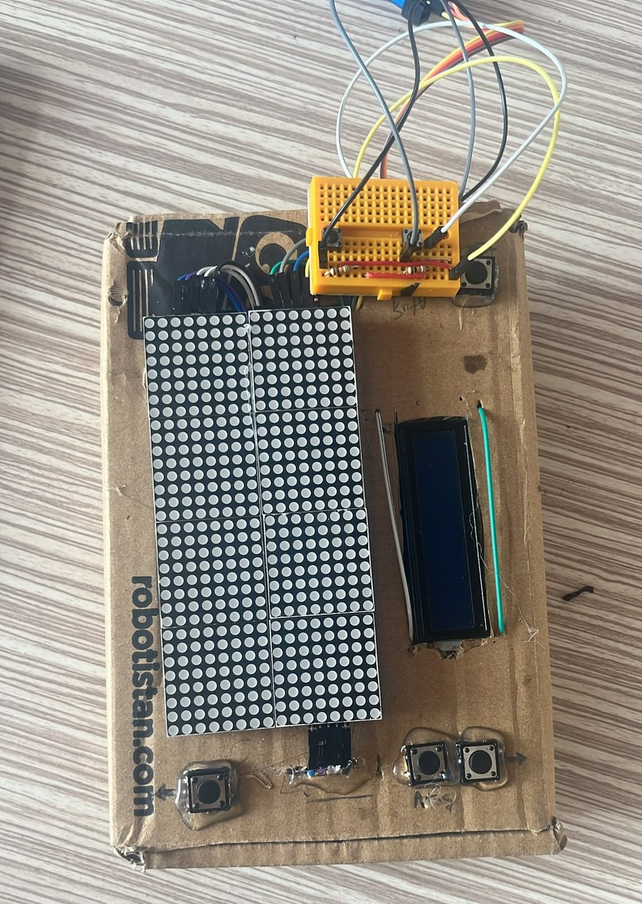
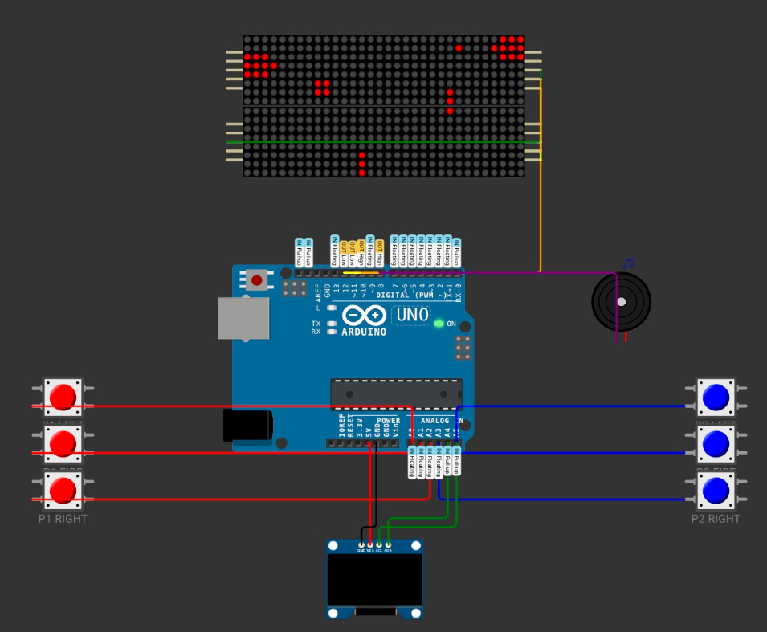
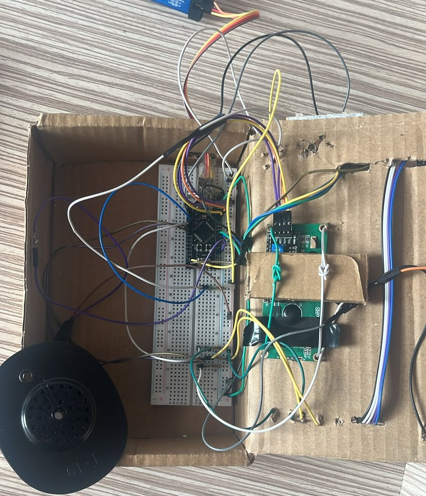
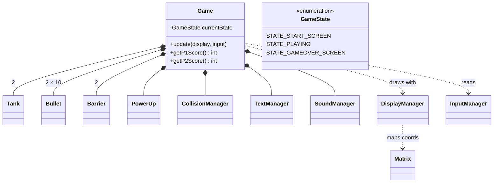

# Matrix Tank War 🎮

A two-player tank battle game running on a **16 × 32 LED display built from eight daisy-chained MAX7219 8×8 matrices**, driven by an **STM32** microcontroller and written in modular, object-oriented C++ (Arduino framework).

Two players face each other from the top and bottom of the screen, dodge moving barriers, shoot mystery power-ups, and try to land five hits first. Scores are shown on a 16×2 I²C LCD and every event has its own buzzer sound effect.

<p align="center">
  
</p>

---

## Features

- **16 × 32 pixel playfield** made of 8 MAX7219 modules, addressed as one logical screen
- **Two-player local multiplayer** – 3 buttons per player (left / right / fire)
- **Up to 10 bullets in flight per player**, with a per-player adjustable fire rate
- **Moving barriers** that spawn randomly and absorb bullets
- **Mystery power-ups** – a 2×2 box is a reward, a 3×2 box is a trap:
  - Rewards: +1 point, rapid fire, or freeze the opponent for 3 s
  - Traps: −1 point, slow fire, or freeze yourself for 3 s
- **Game state machine**: scrolling start screen → match → scrolling winner screen
- **Custom 5×7 font** with vertical text scrolling on the LED matrix
- **Procedurally generated sound effects** (shots, hits, wall hits, victory, game over)
- **Live scoreboard** on a 16×2 I²C LCD (redrawn only when the score changes)

## Hardware

| Component | Qty | Notes |
|---|---|---|
| STM32 board (STM32duino core) | 1 | Programmed through an ST-LINK V2 |
| MAX7219 8×8 LED matrix module | 8 | Daisy-chained, arranged 2 wide × 4 tall |
| 16×2 LCD with I²C backpack | 1 | Address `0x27` |
| Push buttons | 6 | Active-HIGH with external pull-down resistors |
| Passive buzzer / speaker | 1 | Driven with `tone()` |

### Pin mapping

| Signal | Pin | Defined in |
|---|---|---|
| MAX7219 DIN | 11 | `Config.h` |
| MAX7219 CLK | 12 | `Config.h` |
| MAX7219 CS | 10 | `Config.h` |
| Buzzer | 8 | `Config.h` |
| P1 Left / Fire / Right | A0 / A1 / A2 | `Config.h` |
| P2 Right / Fire / Left | A3 / A4 / A5 | `Config.h` |
| LCD SDA / SCL | PB7 / PB6 | `TankBattle.ino` |

### Display layout

The eight matrices form a 16-pixel-wide, 32-pixel-tall screen. `Matrix.cpp` converts a global `(x, y)` coordinate into a device index on the SPI chain plus a local coordinate inside that 8×8 module:

```
           x: 0 ────── 7   8 ────── 15
 y  0 –  7    [ dev 7 ]     [ dev 3 ]      ← Player 2 (top)
 y  8 – 15    [ dev 6 ]     [ dev 2 ]
 y 16 – 23    [ dev 5 ]     [ dev 1 ]
 y 24 – 31    [ dev 4 ]     [ dev 0 ]      ← Player 1 (bottom)
```

<details>
<summary>Early prototype wiring (simulator, Arduino Uno + OLED)</summary>
<br>
The game was first prototyped in a circuit simulator on an Arduino Uno with an OLED screen, then ported to the STM32 + 16×2 LCD build shown above. Pin assignments in the final build follow <code>Config.h</code>, not this image.
<br><br>

</details>

<details>
<summary>Inside the enclosure</summary>
<br>

</details>

## Software architecture

The code is layered so that each module only depends on the ones below it:

```
Config.h                      constants and pin definitions
   └── Matrix                 global → (device, local) coordinate mapping
        └── DisplayManager    pixel / rectangle drawing on top of LedControl
InputManager                  button reads + millis()-based timing helper
SoundManager                  buzzer sound effects
   └── Tank · Bullet · Barrier · PowerUp      game entities
        └── CollisionManager                  point-in-rectangle hit tests
             └── TextManager                  5×7 font, vertical scroller
                  └── Game                    state machine, rules, scoring
                       └── TankBattle.ino     setup() / loop() + LCD scoreboard
```



Movement, bullet travel, barrier travel, fire rate, text scrolling and power-up spawning are all timed with `millis()` through `InputManager::isTimePassed()`, so each object advances at its own speed inside a single main loop.

## Building and uploading

1. Install the **Arduino IDE** and add the **STM32duino** board package (*STM32 MCU based boards* by STMicroelectronics).
2. Install the libraries:
   - **LedControl** (Eberhard Fahle) – from the Library Manager
   - **LiquidCrystal_I2C** – a version whose `begin()` takes no arguments (e.g. Frank de Brabander's)
3. Open `TankBattle/TankBattle.ino`, select your STM32 board, set the upload method to **STLink**, and upload.

## How to play

1. The start screen scrolls, then a round begins. Each tank appears as soon as its player first moves.
2. Move left/right and fire. Bullets travel straight toward the opponent.
3. Barriers sliding across the middle block bullets. Every few seconds a mystery box appears – shoot it to trigger its effect.
4. Every hit scores a point and resets the tanks. **The first player to reach 5 points wins.**

## Known limitations and future work

These are honest notes on what I would improve today:

- **Blocking audio and animation.** Sound effects and the explosion blink use `delay()`, so the game briefly pauses on each shot or hit. The fix is a non-blocking sound queue stepped by `millis()` or a hardware timer.
- **Per-pixel SPI writes.** Every pixel change is sent to the MAX7219 chain immediately. An in-RAM framebuffer flushed once per frame would be faster and remove flicker.
- **Duplicated player logic.** Player 1 and Player 2 code paths in `Game.cpp` are mirrored by hand and could be merged into a `Player` structure.
- **Input handling.** Buttons are rate-limited rather than truly debounced, and the lookup table in `InputManager::isPressed()` reserves 1 KB of RAM – fine on STM32, too much for an ATmega328.
- **Naming.** The `isPlayer1` flag in `Tank` really means "top tank".
- **LCD event messages** (`Game::getLcdMessage()`) are implemented but not displayed yet; power-up fire-rate changes last until the next round.

The original development plan is in [`docs/planning/original-roadmap.md`](docs/planning/original-roadmap.md), and the planned refactor (hearts per match, match-win counter) is in [`docs/planning/refactor-notes.md`](docs/planning/refactor-notes.md).

## Repository layout

```
matrix-tank-war/
├── TankBattle/            Arduino sketch (open TankBattle.ino)
├── docs/
│   ├── images/            photos and prototype wiring
│   └── planning/          original roadmap and refactor notes
├── LICENSE
└── README.md
```

## License

Released under the [MIT License](LICENSE).
